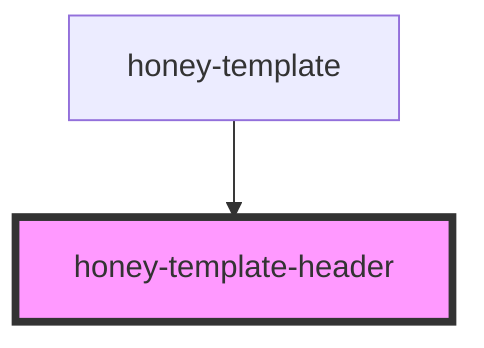

# honey-template-header

<!-- Auto Generated Below -->

## Dependencies

### Used by

 - [honey-template](..)

### Graph

----------------------------------------------

*Built with [StencilJS](https://stenciljs.com/)* by Huluvu424242
