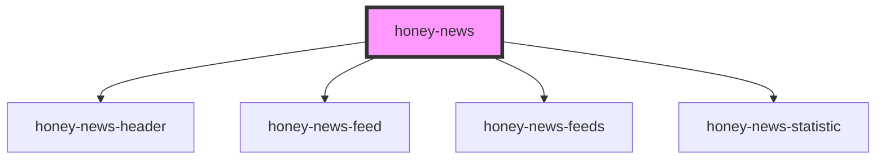

# honey-news

<!-- Auto Generated Below -->

## Properties

| Property             | Attribute        | Description                     | Type                        | Default     |
| -------------------- | ---------------- | ------------------------------- | --------------------------- | ----------- |
| `feedAdministration` | --               | Feeds Administration Komponente | `HTMLHoneyNewsFeedsElement` | `undefined` |
| `localBasePath`      | `local-basepath` | base of local site              | `any`                       | `undefined` |
| `newsFeed`           | --               | News reader Komponente          | `HTMLHoneyNewsFeedElement`  | `undefined` |
| `siteBasePath`       | `site-basepath`  | base of remote site             | `any`                       | `undefined` |
| `verbose`            | `verbose`        | enable console logging          | `boolean`                   | `false`     |

## Dependencies

### Depends on

- [honey-news-header](header)
- [honey-news-feed](news)
- [honey-news-feeds](feeds)
- [honey-news-statistic](statistic)

### Graph

----------------------------------------------

*Built with [StencilJS](https://stenciljs.com/)* by Huluvu424242
