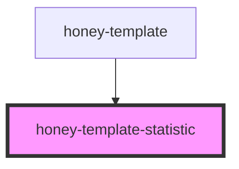

# honey-template-statistic

<!-- Auto Generated Below -->

## Properties

| Property  | Attribute | Description            | Type      | Default |
| --------- | --------- | ---------------------- | --------- | ------- |
| `verbose` | `verbose` | enable console logging | `boolean` | `false` |

## Methods

### `updateOptions(options: StatisticOptions) => Promise<void>`

Update statistic options

#### Returns

Type: `Promise<void>`

## Dependencies

### Used by

 - [honey-template](..)

### Graph

----------------------------------------------

*Built with [StencilJS](https://stenciljs.com/)* by Huluvu424242
